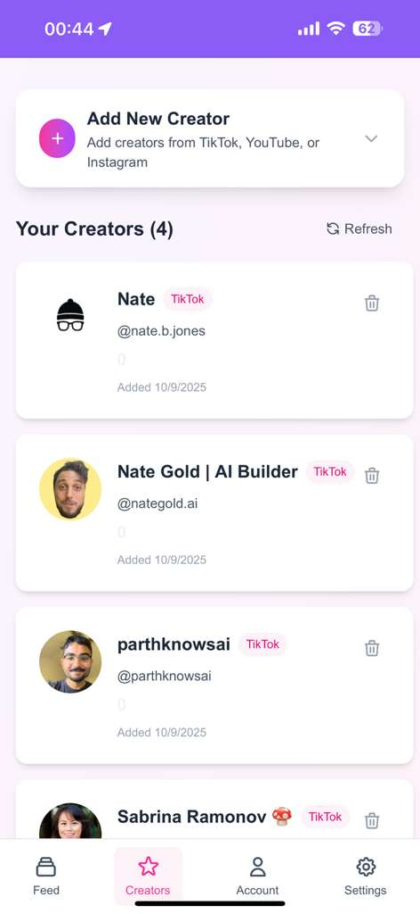
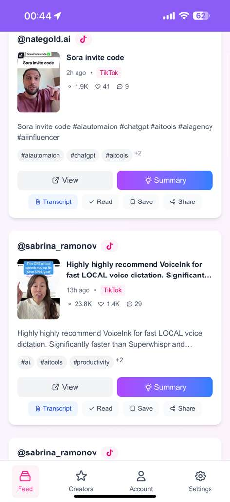
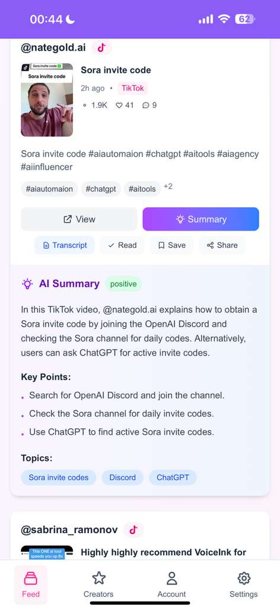

# 🎬 Social Media Aggregator

[](https://nextjs.org/)
[](https://www.typescriptlang.org/)
[](https://tailwindcss.com/)
[](https://supabase.com/)
[](https://opensource.org/licenses/MIT)

> An AI-powered social media content aggregation platform that transforms how you consume content from your favorite creators across TikTok, YouTube, and Instagram.

## 🌐 Live Demo

**Try it now**: [https://social-media-aggregator-phi.vercel.app/](https://social-media-aggregator-phi.vercel.app/)

*Install as a mobile app directly from your browser!*

## 🌟 Features

- 🤖 **AI-Powered Summaries** - Intelligent content analysis using OpenAI and Anthropic
- 📱 **Mobile-First PWA** - Install as a native app on any device
- 🎯 **Multi-Platform** - TikTok (active), YouTube & Instagram (coming soon)
- 🔍 **Advanced Filtering** - Sort, filter, and organize content efficiently
- 📝 **Smart Transcription** - Searchable text from video content
- 🎨 **Modern UI** - Clean, responsive design with collapsible interface
- 🔒 **Privacy-Focused** - Secure data storage with end-to-end encryption
- ⚡ **Performance Optimized** - Fast loading with smart caching

## 📱 Progressive Web App

Install as a native mobile app:

| Platform | Installation |
|----------|-------------|
| **iOS** | Safari → Share → "Add to Home Screen" |
| **Android** | Chrome → Menu → "Install App" |
| **Desktop** | Chrome/Edge → Install icon in address bar |

## 📸 Screenshots

<div align="center">

<table>
<tr>
<td align="center" width="25%">
<h4>⭐ Add Creators</h4>

<br><em>Easy creator management - add your favorite TikTok creators</em>
</td>
<td align="center" width="25%">
<h4>📱 Content Feed</h4>

<br><em>AI-powered content feed with intelligent summaries and filtering</em>
</td>
<td align="center" width="25%">
<h4>🤖 AI Summary</h4>

<br><em>Comprehensive AI-generated summaries with key points and sentiment analysis</em>
</td>
<td align="center" width="25%">
<h4>📝 Full Transcripts</h4>

<br><em>Complete video transcripts with searchable text</em>
</td>
</tr>
</table>

</div>

## 🚀 Quick Start

### Prerequisites

- Node.js 18+
- Supabase account
- API keys (TikTok RapidAPI, OpenAI/Anthropic)

### Installation

```bash
# Clone the repository
git clone https://github.com/eliharoun/social-media-aggregator.git
cd social-media-aggregator

# Install dependencies
npm install

# Set up environment variables
cp .env.example .env.local
# Edit .env.local with your API keys

# Set up database
# Run database-setup.sql in your Supabase SQL editor

# Start development server
npm run dev
```

Open [http://localhost:3000](http://localhost:3000) to view the app.

## 🔧 Environment Variables

Create a `.env.local` file with the following variables:

```env
# Supabase Configuration
NEXT_PUBLIC_SUPABASE_URL=your_supabase_project_url
NEXT_PUBLIC_SUPABASE_ANON_KEY=your_supabase_anon_key
SUPABASE_SERVICE_ROLE_KEY=your_supabase_service_role_key

# TikTok API (Multiple keys for redundancy)
RAPIDAPI_KEY_1=your_rapidapi_key_1
RAPIDAPI_KEY_2=your_rapidapi_key_2
RAPIDAPI_KEY_3=your_rapidapi_key_3

# Transcript Services
TRANSCRIPT_API_KEY_1=your_transcript_api_key_1
TRANSCRIPT_API_KEY_2=your_transcript_api_key_2

# AI Services
OPENAI_API_KEY=your_openai_api_key
ANTHROPIC_API_KEY=your_anthropic_api_key
DEFAULT_LLM_PROVIDER=openai
```

## 🏗 Architecture

### Tech Stack

- **Frontend**: Next.js 15, React 19, TypeScript, Tailwind CSS
- **Backend**: Supabase (PostgreSQL + Auth + Edge Functions)
- **AI**: LangChain, OpenAI GPT-4o-mini, Anthropic Claude
- **Deployment**: Vercel (optimized for Hobby plan)

### Database Schema

```sql
-- Core Tables
├── users (Supabase Auth)
├── user_profiles (display names, bios)
├── user_settings (app preferences)
├── favorite_creators (followed creators)
├── content (aggregated posts/videos)
├── transcripts (video-to-text)
├── summaries (AI-generated summaries)
└── user_content_interactions (read/saved status)
```

## 📖 Usage Guide

### 1. Add Creators
Navigate to the **Creators** tab and add your favorite TikTok creators by username.

### 2. Refresh Content
Go to the **Dashboard** and click the refresh button to fetch the latest content.

### 3. AI Processing
The app automatically:
- Generates transcripts from videos
- Creates intelligent summaries
- Extracts key points and topics
- Analyzes sentiment

### 4. Organize Content
Use the collapsible filter controls to:
- Filter by platform
- Sort by date or engagement
- Hide already-read content

### 5. Manage Account
In the **Account** tab:
- Update your profile information
- Change your password
- Sign out or delete account

## 🎯 Key Components

### Dashboard Features
- **Infinite Scroll**: Seamless content browsing
- **Collapsible Filters**: Space-efficient filtering controls
- **Real-Time Processing**: Live AI summary generation
- **Mobile-Optimized**: Touch-friendly interface

### Content Cards
- **Smart Thumbnails**: Optimized image loading
- **Processing Indicators**: Visual feedback for AI processing
- **Action Buttons**: Read, save, share functionality
- **Expandable Summaries**: Toggle detailed AI analysis

### Account Management
- **Profile Editing**: Display name, bio, email updates
- **Security**: Password management and secure authentication
- **Data Control**: Cache clearing and account deletion
- **Collapsible Interface**: Mobile-friendly card design

## 🔄 API Integration

### Supported Platforms

| Platform | Status | Features |
|----------|--------|----------|
| **TikTok** | ✅ Active | Content fetching, transcripts, summaries |
| **YouTube** | 🔄 Coming Soon | Infrastructure ready |
| **Instagram** | 🔄 Coming Soon | Infrastructure ready |

### AI Providers

- **OpenAI GPT-4o-mini**: Primary summarization model
- **Anthropic Claude Haiku**: Alternative model for redundancy
- **Automatic Fallback**: Switches providers if one fails

## 🚀 Deployment

### Vercel (Recommended)

```bash
# Install Vercel CLI
npm install -g vercel

# Deploy
vercel --prod
```

### Environment Setup
1. Configure environment variables in Vercel dashboard
2. Set up custom domain (optional)
3. Enable Vercel Analytics for monitoring

See [DEPLOYMENT.md](DEPLOYMENT.md) for detailed deployment instructions.

## 🤝 Contributing

We welcome contributions! Here's how to get started:

1. **Fork the repository**
2. **Create a feature branch**: `git checkout -b feature/amazing-feature`
3. **Make your changes** following the existing patterns
4. **Test thoroughly** on mobile and desktop
5. **Submit a pull request**

### Development Guidelines

- Follow the existing TypeScript patterns
- Use Tailwind CSS for styling
- Ensure mobile-first responsive design
- Add proper error handling
- Include loading states for better UX

### Adding New Platforms

The architecture supports easy platform addition:

1. Add platform to database schema
2. Create API integration in `/api` routes
3. Update UI components with platform-specific logic
4. Add platform icons and branding

## 📊 Performance

### Metrics
- ⚡ **Initial Load**: < 2 seconds
- 🔄 **Feed Refresh**: < 1 second (cached)
- 🤖 **AI Processing**: < 10 seconds per batch

### Optimizations
- Client-side batch processing
- Smart caching strategies
- Progressive loading
- Bundle size optimization
- Vercel Edge Functions

## 🐛 Known Issues

- TikTok API rate limits may cause temporary delays
- AI processing requires stable internet connection
- Some older mobile browsers may have limited PWA support

## 📝 Changelog

### v0.1.0 (Current)
- ✅ TikTok content aggregation
- ✅ AI-powered summarization
- ✅ Mobile-first PWA design
- ✅ Account management system
- ✅ Advanced filtering and sorting
- ✅ Collapsible interface design

## 🔮 Roadmap

- [ ] YouTube integration
- [ ] Instagram integration
- [ ] Push notifications
- [ ] Advanced search functionality
- [ ] Content analytics dashboard
- [ ] Social sharing features
- [ ] Offline content caching
- [ ] Multi-language support

## 📄 License

This project is licensed under the MIT License - see the [LICENSE](LICENSE) file for details.

## 🙏 Acknowledgments

- [Next.js](https://nextjs.org/) - React framework
- [Supabase](https://supabase.com/) - Backend as a Service
- [OpenAI](https://openai.com/) - AI summarization
- [Tailwind CSS](https://tailwindcss.com/) - Styling framework
- [Vercel](https://vercel.com/) - Deployment platform

## 📞 Support

- 🐛 **Bug Reports**: [Open an issue](https://github.com/eliharoun/social-media-aggregator/issues)
---

<div align="center">

**⭐ Star this repo if you find it useful!**

</div>
