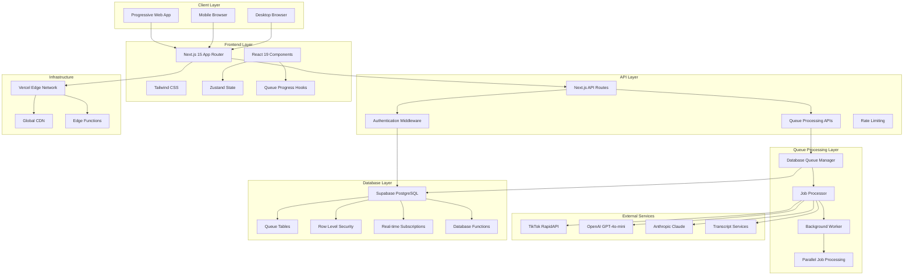
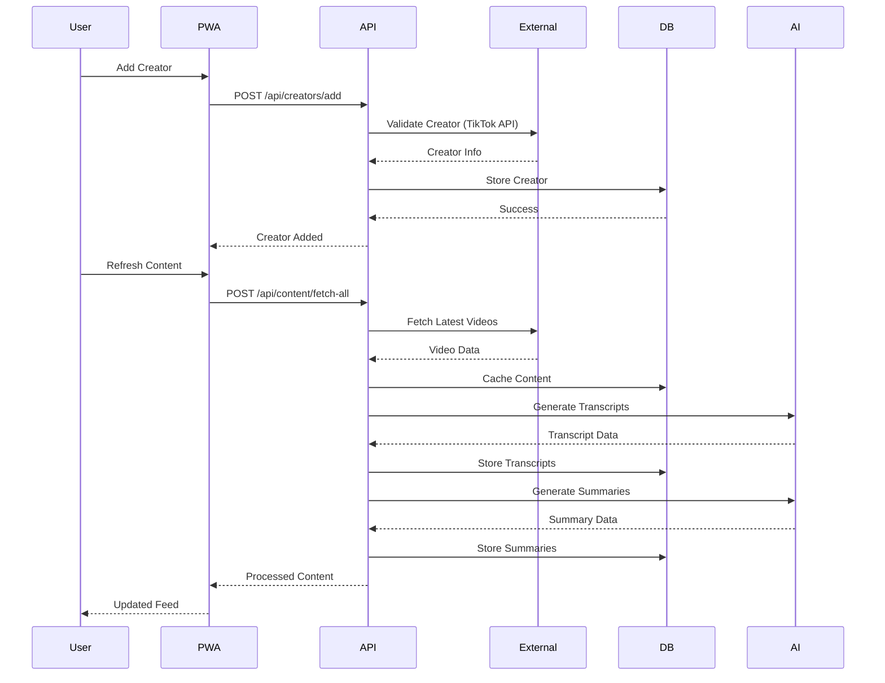
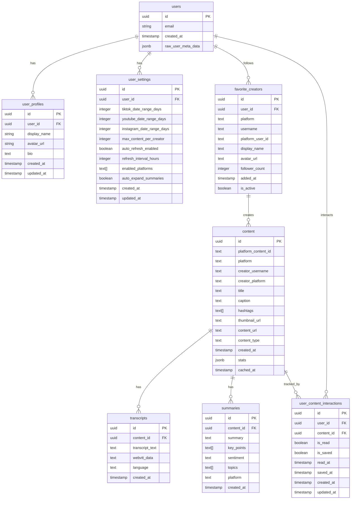
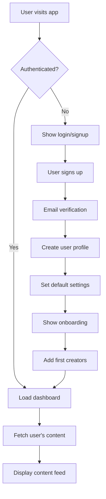
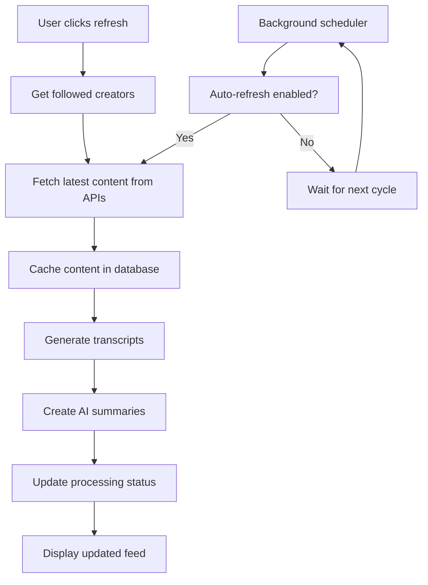
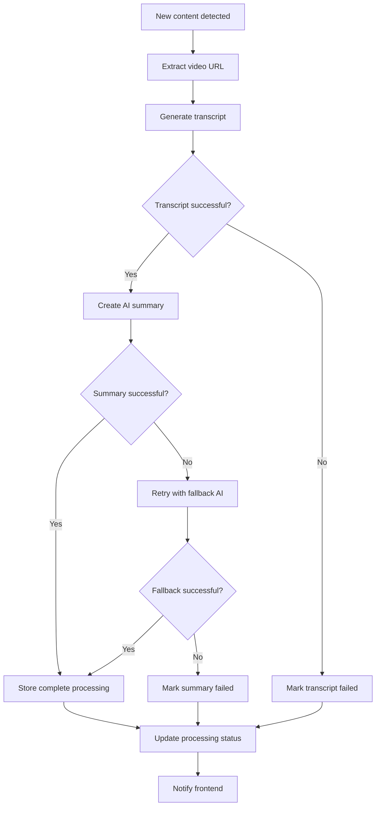
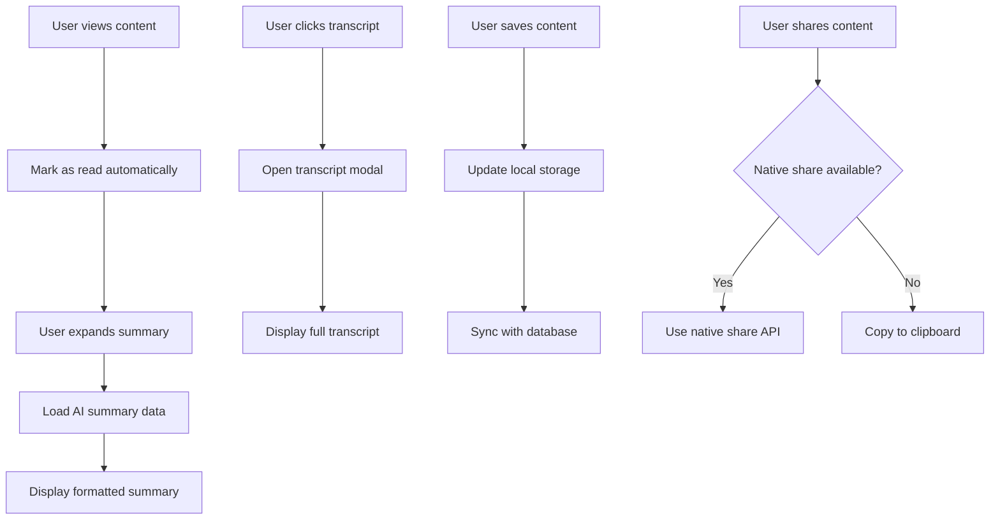
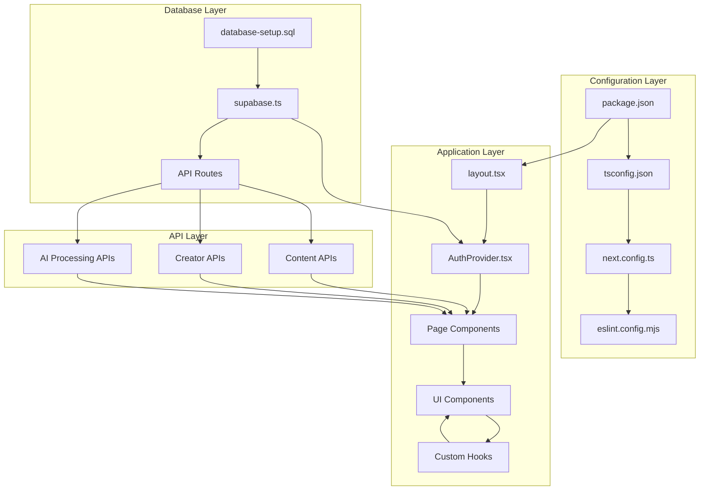

# Social Media Aggregator - Complete Technical Documentation

## Table of Contents
1. [Project Overview](#project-overview)
2. [Technology Stack](#technology-stack)
3. [Architecture](#architecture)
4. [Database Schema](#database-schema)
5. [API Documentation](#api-documentation)
6. [Component Architecture](#component-architecture)
7. [Features Documentation](#features-documentation)
8. [Application Flow](#application-flow)
9. [File Structure Reference](#file-structure-reference)
10. [Setup and Installation](#setup-and-installation)
11. [Deployment](#deployment)

## Project Overview

### Purpose and Description
The Social Media Aggregator is an AI-powered Progressive Web Application (PWA) that aggregates content from multiple social media platforms (TikTok, YouTube, Instagram) and provides intelligent summarization and transcription services. The application allows users to follow their favorite creators, automatically fetch their latest content, and receive AI-generated summaries and transcripts for efficient content consumption.

### Key Features
- **Multi-Platform Content Aggregation**: Supports TikTok and YouTube (active), Instagram infrastructure ready
- **AI-Powered Summarization**: Uses OpenAI GPT-4o-mini and Anthropic Claude for intelligent content analysis
- **Automatic Transcription**: Converts video content to searchable text with 4-tier fallback system
- **Progressive Web App**: Installable on mobile and desktop devices
- **Real-time Processing**: Live AI processing with visual feedback and queue-based architecture
- **User Management**: Complete authentication and profile management
- **Advanced Filtering**: Mobile-optimized horizontal scrollable filters with platform-specific sorting
- **Database-Based Queue System**: Scalable background processing with 3x performance improvement
- **Intelligent Thumbnail Fallback**: Handles expired URLs with creator avatars and platform logos
- **YouTube Integration**: Full support for YouTube creators with channel validation and long-form content handling
- **Robust Transcript Generation**: 4-tier fallback system with native captions and Supadata AI integration
- **Dynamic Timeout Handling**: Intelligent timeout scaling based on content length (12-20 seconds for YouTube)
- **Mobile UX Optimization**: Enhanced infinite scroll, touch events, and pull-to-refresh functionality

## Technology Stack

### Frontend
- **Framework**: Next.js 15.5.4 with App Router
- **Language**: TypeScript 5.0
- **UI Library**: React 19.1.0
- **Styling**: Tailwind CSS 4.0
- **State Management**: Zustand 5.0.8
- **Image Optimization**: Next.js Image component

### Backend
- **Runtime**: Node.js with Next.js API Routes
- **Database**: Supabase (PostgreSQL) with Database-Based Queue System
- **Authentication**: Supabase Auth
- **File Storage**: Supabase Storage
- **Real-time**: Supabase Realtime
- **Queue Processing**: Custom database queue with parallel job processing
- **Background Workers**: Serverless queue processors with automatic retry logic

### AI Services
- **LLM Framework**: LangChain 0.3.35
- **Primary AI**: OpenAI GPT-4o-mini (@langchain/openai 0.6.14)
- **Secondary AI**: Anthropic Claude Haiku (@langchain/anthropic 0.3.30)
- **Fallback Strategy**: Automatic provider switching on failure

### External APIs
- **TikTok**: RapidAPI TikTok API (multiple keys for redundancy)
- **YouTube**: YouTube138 RapidAPI for channel and video data (active)
- **Transcription**: Multiple transcript API services + Supadata AI
- **Supadata AI**: Professional AI transcription service (3 API keys for redundancy)
- **Instagram**: Infrastructure ready (API integration pending)

### Development Tools
- **Linting**: ESLint 9 with Next.js config
- **Build Tool**: Turbopack (Next.js 15 feature)
- **Package Manager**: npm
- **Version Control**: Git

### Deployment
- **Platform**: Vercel (optimized for Hobby plan)
- **CDN**: Vercel Edge Network
- **Analytics**: Vercel Analytics (optional)
- **Monitoring**: Built-in error tracking

## Architecture

### Architecture Pattern
The application follows a **Modern Full-Stack Architecture with Database-Based Queue Processing** with the following characteristics:

- **Frontend**: React-based SPA with SSR capabilities
- **Backend**: Serverless API routes with edge computing
- **Database**: Cloud-native PostgreSQL with real-time capabilities and queue system
- **Queue Architecture**: Database-based job queue with parallel processing optimization
- **Authentication**: JWT-based with refresh tokens
- **State Management**: Client-side state with server synchronization
- **Caching**: Multi-layer caching (browser, CDN, database)
- **Background Processing**: Asynchronous job processing with automatic retry and timeout protection

### System Architecture Diagram



### Data Flow Architecture



## Database Schema

### Entity Relationship Diagram



### Table Descriptions

#### Core Tables

**users** (Supabase Auth)
- Managed by Supabase authentication system
- Contains basic user authentication data
- Links to all user-specific tables

**user_profiles**
- Extended user information for display purposes
- Stores display names, avatars, and bio information
- Automatically created on user signup

**user_settings**
- User preferences and configuration
- Controls content fetching behavior, date ranges, and UI preferences
- Default values applied on account creation

**favorite_creators**
- Tracks which creators a user follows
- Supports multiple platforms (TikTok, YouTube, Instagram)
- Includes creator metadata and follower counts
- Soft delete with `is_active` flag

#### Content Tables

**content**
- Central table for all aggregated social media content
- Platform-agnostic design supports multiple social media platforms
- Stores metadata, statistics, and links to original content
- Unique constraint on platform + platform_content_id

**transcripts**
- AI-generated transcripts from video content
- Supports multiple languages and formats (WebVTT)
- One-to-one relationship with content

**summaries**
- AI-generated summaries with key points and sentiment analysis
- Includes topic extraction and categorization
- One-to-one relationship with content

**user_content_interactions**
- Tracks user interactions with content (read/saved status)
- Enables personalized filtering and recommendations
- Timestamps for analytics and user behavior tracking

### Row Level Security (RLS)

All tables implement comprehensive Row Level Security policies:

- **Users can only access their own data**
- **Content is filtered by followed creators**
- **Transcripts and summaries inherit content access permissions**
- **Automatic policy enforcement at database level**

### Duplicate Prevention and Unique Constraints

The database schema implements several unique constraints to prevent duplicates:

**Tables with UNIQUE Constraints:**

1. **user_settings**
   - `UNIQUE(user_id)` - Each user can have only ONE settings record
   - Automatically created via trigger on user signup

2. **user_profiles**
   - `UNIQUE(user_id)` - Each user can have only ONE profile record
   - Automatically created via trigger on user signup

3. **favorite_creators**
   - `UNIQUE(user_id, platform, username)` - Prevents duplicate creator follows
   - A user cannot follow the same creator on the same platform twice
   - Example: User cannot add "@creator123" on TikTok multiple times

4. **content**
   - `UNIQUE(platform, platform_content_id)` - Prevents duplicate content entries
   - Same content from a platform cannot be stored multiple times
   - Example: TikTok video with ID "7123456789" can only exist once

5. **user_content_interactions**
   - `UNIQUE(user_id, content_id)` - One interaction record per user per content
   - Prevents duplicate read/saved status entries
   - Updates existing record instead of creating duplicates

6. **transcripts**
   - `UNIQUE(content_id)` - Ensures one transcript per content item
   - Prevents duplicate processing and data inconsistency
   - Built into table definition for clean schema

7. **summaries**
   - `UNIQUE(content_id)` - Ensures one summary per content item
   - Prevents UI confusion and duplicate AI processing
   - Built into table definition for clean schema

8. **users** (Supabase Auth)
   - Email uniqueness enforced by Supabase Auth system
   - No additional database constraints needed

### Database-Based Queue System

The application implements a sophisticated database-based queue system for processing content asynchronously, solving Vercel's 10-second timeout limitations and enabling parallel processing for improved performance.

#### Queue Tables

**processing_sessions**
- Tracks user processing sessions with progress monitoring
- Manages session lifecycle (active, completed, failed)
- Stores error summaries and completion statistics
- Unique constraint prevents duplicate active sessions per user

**processing_jobs**
- Individual job entries for content fetch, transcript, and summary operations
- Priority-based processing with automatic retry logic
- Timeout protection and failure tracking
- Job types: `content_fetch`, `transcript`, `summary`

#### Database Functions

**get_pending_jobs(job_type, batch_size)**
```sql
-- Retrieves pending jobs with retry logic and priority ordering
-- Filters out jobs that have exceeded maximum retry attempts
-- Orders by priority (lower number = higher priority) and creation date
```

**Automatic User Setup**
```sql
-- Creates user settings and profile on signup
CREATE FUNCTION handle_new_user() RETURNS TRIGGER
CREATE FUNCTION handle_new_user_profile() RETURNS TRIGGER
```

**Timestamp Management**
```sql
-- Updates updated_at timestamps automatically
CREATE FUNCTION handle_updated_at() RETURNS TRIGGER
```

#### Queue Architecture Benefits

1. **Scalability**: Eliminates Vercel's 10-second timeout by processing jobs asynchronously
2. **Reliability**: Automatic retry logic with exponential backoff
3. **Performance**: Parallel processing of AI operations (3x speed improvement)
4. **Monitoring**: Real-time progress tracking with visual indicators
5. **Fault Tolerance**: Graceful handling of API failures and service outages

## API Documentation

### Authentication

All API endpoints require authentication via Bearer token:

```http
Authorization: Bearer <supabase_access_token>
```

### Content Management APIs

#### GET /api/content/list

Retrieves paginated content from followed creators.

**Query Parameters:**
- `platform` (optional): Filter by platform (`tiktok`, `youtube`, `instagram`)
- `limit` (optional): Number of items per page (default: 20, max: 100)
- `offset` (optional): Pagination offset (default: 0)

**Response:**
```json
{
  "content": [
    {
      "id": "uuid",
      "platform_content_id": "string",
      "platform": "tiktok",
      "creator_username": "string",
      "title": "string",
      "caption": "string",
      "hashtags": ["string"],
      "thumbnail_url": "string",
      "content_url": "string",
      "content_type": "video",
      "created_at": "timestamp",
      "stats": {
        "views": 1000,
        "likes": 100,
        "comments": 50,
        "shares": 25
      },
      "transcripts": [
        {
          "id": "uuid",
          "transcript_text": "string",
          "language": "en"
        }
      ],
      "summaries": [
        {
          "id": "uuid",
          "summary": "string",
          "key_points": ["string"],
          "sentiment": "positive",
          "topics": ["string"]
        }
      ]
    }
  ],
  "grouped": {
    "tiktok": [],
    "youtube": [],
    "instagram": []
  },
  "total": 100,
  "hasMore": true,
  "pagination": {
    "limit": 20,
    "offset": 0,
    "nextOffset": 20
  }
}
```

#### POST /api/content/fetch-all

Fetches latest content from all followed creators and processes with AI.

**Request Body:**
```json
{}
```

**Response:**
```json
{
  "allContent": [],
  "firstPage": [],
  "totalCount": 50,
  "totalPages": 5,
  "cacheStats": {
    "inserted": 10,
    "updated": 5
  },
  "errors": [],
  "processingTime": 5000
}
```

#### POST /api/content/process-page

Processes a batch of content for AI transcription and summarization.

**Request Body:**
```json
{
  "contentIds": ["uuid1", "uuid2", "uuid3"]
}
```

**Response:**
```json
{
  "results": [
    {
      "content_id": "uuid",
      "hasTranscript": true,
      "hasSummary": true,
      "error": null
    }
  ],
  "processingTime": 8000
}
```

#### GET /api/content/fetch-chunk

Retrieves a specific chunk of content for infinite scrolling.

**Query Parameters:**
- `page` (required): Page number (0-based)
- `limit` (optional): Items per page (default: 10)
- `platform` (optional): Platform filter

**Response:**
```json
{
  "content": [],
  "hasMore": true,
  "nextPage": 2,
  "total": 100
}
```

#### POST /api/content/ensure-summaries

Ensures all content has AI summaries, processing missing ones.

**Request Body:**
```json
{
  "contentIds": ["uuid1", "uuid2"]
}
```

**Response:**
```json
{
  "processed": 5,
  "skipped": 2,
  "errors": []
}
```

### Creator Management APIs

#### GET /api/creators/list

Lists all creators followed by the authenticated user.

**Response:**
```json
{
  "creators": [
    {
      "id": "uuid",
      "platform": "tiktok",
      "username": "creator_username",
      "platform_user_id": "string",
      "display_name": "Creator Name",
      "avatar_url": "string",
      "follower_count": 1000000,
      "added_at": "timestamp",
      "is_active": true
    }
  ]
}
```

#### POST /api/creators/add

Adds a new creator to follow.

**Request Body:**
```json
{
  "platform": "tiktok",
  "username": "creator_username"
}
```

**Response:**
```json
{
  "creator": {
    "id": "uuid",
    "platform": "tiktok",
    "username": "creator_username",
    "platform_user_id": "string",
    "display_name": "Creator Name",
    "avatar_url": "string",
    "follower_count": 1000000,
    "added_at": "timestamp",
    "is_active": true
  }
}
```

**Error Responses:**
- `400`: Invalid platform or username
- `409`: Creator already added
- `404`: Creator not found on platform

#### DELETE /api/creators/remove

Removes a creator from following list (soft delete).

**Request Body:**
```json
{
  "creatorId": "uuid"
}
```

**Response:**
```json
{
  "success": true,
  "message": "Creator removed successfully"
}
```

### Queue Processing APIs

#### POST /api/queue/process

Background worker endpoint for processing queued jobs with parallel optimization.

**Features:**
- Processes jobs in priority order: content_fetch → transcript → summary
- Parallel processing for AI operations (8 summary jobs simultaneously)
- Automatic retry logic with exponential backoff
- Continuous processing cycles with automatic triggering
- 3x performance improvement over sequential processing

**Request Body:**
```json
{}
```

**Response:**
```json
{
  "processed": 15,
  "errors": 2,
  "processingTime": 7500,
  "details": {
    "processedJobs": [
      {
        "jobId": "uuid",
        "jobType": "summary",
        "status": "completed"
      }
    ],
    "errors": [
      {
        "jobId": "uuid",
        "jobType": "transcript",
        "error": "API timeout"
      }
    ]
  },
  "affectedUsers": 3,
  "pendingJobsRemaining": 5,
  "willTriggerNextCycle": true
}
```

#### GET /api/queue/process

Queue status endpoint for monitoring and health checks.

**Response:**
```json
{
  "queueStatus": {
    "contentFetch": {
      "pending": 2,
      "nextJob": {
        "id": "uuid",
        "job_type": "content_fetch",
        "created_at": "timestamp"
      }
    },
    "transcript": {
      "pending": 8,
      "nextJob": null
    },
    "summary": {
      "pending": 12,
      "nextJob": {
        "id": "uuid",
        "job_type": "summary",
        "created_at": "timestamp"
      }
    }
  },
  "totalPendingJobs": 22
}
```

#### GET /api/queue/progress

Real-time progress tracking for user processing sessions.

**Query Parameters:**
- Requires authentication via Bearer token

**Response:**
```json
{
  "hasActiveSession": true,
  "progress": {
    "sessionId": "uuid",
    "totalJobs": 25,
    "completedJobs": 18,
    "failedJobs": 2,
    "currentPhase": "summarizing",
    "errors": ["API timeout for transcript generation"]
  }
}
```

**Processing Phases:**
- `fetching`: Retrieving content from social media APIs
- `transcribing`: Converting videos to text transcripts
- `summarizing`: Generating AI summaries
- `completed`: All processing finished

### AI Processing APIs

#### POST /api/transcripts/generate

Generates transcripts for video content.

**Request Body:**
```json
{
  "contentId": "uuid",
  "contentUrl": "string",
  "language": "en"
}
```

**Response:**
```json
{
  "transcript": {
    "id": "uuid",
    "content_id": "uuid",
    "transcript_text": "string",
    "webvtt_data": "string",
    "language": "en",
    "created_at": "timestamp"
  }
}
```

#### POST /api/summaries/create

Creates AI-powered summaries for content.

**Request Body:**
```json
{
  "contentId": "uuid",
  "transcriptText": "string",
  "contentMetadata": {
    "title": "string",
    "caption": "string",
    "platform": "tiktok"
  }
}
```

**Response:**
```json
{
  "summary": {
    "id": "uuid",
    "content_id": "uuid",
    "summary": "string",
    "key_points": ["string"],
    "sentiment": "positive",
    "topics": ["string"],
    "platform": "tiktok",
    "created_at": "timestamp"
  }
}
```

### Error Handling

All APIs follow consistent error response format:

```json
{
  "error": "Error message",
  "code": "ERROR_CODE",
  "details": {}
}
```

**Common HTTP Status Codes:**
- `200`: Success
- `400`: Bad Request (invalid parameters)
- `401`: Unauthorized (missing/invalid token)
- `403`: Forbidden (insufficient permissions)
- `404`: Not Found
- `409`: Conflict (duplicate resource)
- `429`: Rate Limited
- `500`: Internal Server Error

## Component Architecture

### Component Hierarchy

```
App Layout (layout.tsx)
├── AuthProvider
    ├── Navigation
    ├── Header
    └── Page Content
        ├── Dashboard
        │   ├── InfiniteScrollContainer
        │   ├── ContentCard[] (with thumbnail fallback system)
        │   ├── ProcessingIndicator
        │   └── QueueProgressIndicator (NEW)
        ├── Creators
        │   ├── CreatorsList (simplified refresh functionality)
        │   ├── CreatorCard[] (cleaned up display)
        │   └── AddCreatorForm
        ├── Account
        │   ├── LoginForm
        │   ├── SignupForm
        │   └── ProfileSettings
        └── Settings
            └── UserPreferences (with queue integration)
```

### Core Components

#### Layout Components

**Layout (`src/components/layout/Layout.tsx`)**
- Main application wrapper
- Handles responsive design and navigation
- Manages global state and authentication context

**Header (`src/components/layout/Header.tsx`)**
- Application branding and user menu
- Responsive navigation toggle
- Real-time user status display

**Navigation (`src/components/layout/Navigation.tsx`)**
- Bottom navigation for mobile
- Sidebar navigation for desktop
- Active route highlighting

#### Authentication Components

**AuthProvider (`src/components/auth/AuthProvider.tsx`)**
- Supabase authentication context provider
- Session management and token refresh
- Protected route handling

**LoginForm (`src/components/auth/LoginForm.tsx`)**
- Email/password authentication
- Social login integration (ready)
- Form validation and error handling

**SignupForm (`src/components/auth/SignupForm.tsx`)**
- User registration with email verification
- Profile setup during registration
- Terms and privacy policy acceptance

#### Dashboard Components

**ContentCard (`src/components/dashboard/ContentCard.tsx`)**
- Individual content item display with enhanced thumbnail fallback system
- AI summary expansion/collapse
- Transcript modal integration
- User interaction tracking (read/saved)
- Social sharing functionality
- Intelligent thumbnail fallback using creator avatars and platform logos
- Handles expired TikTok thumbnail URLs (403 errors)

**InfiniteScrollContainer (`src/components/dashboard/InfiniteScrollContainer.tsx`)**
- Virtualized infinite scrolling
- Performance optimization for large lists
- Loading states and error handling
- Pull-to-refresh functionality

**ProcessingIndicator (`src/components/dashboard/ProcessingIndicator.tsx`)**
- Real-time AI processing status
- Visual feedback for transcript/summary generation
- Error state display
- Progress animations

**QueueProgressIndicator (`src/components/dashboard/QueueProgressIndicator.tsx`)**
- Visual progress tracking for database queue processing
- Phase-based progress display (fetching → transcribing → summarizing → completed)
- Animated progress bars with shimmer effects
- Real-time job completion statistics
- Error handling with retry information
- Auto-completion detection and user feedback

#### Creator Management Components

**CreatorsList (`src/components/creators/CreatorsList.tsx`)**
- Grid/list view of followed creators
- Search and filter functionality
- Bulk operations (remove multiple)
- Creator statistics display

**CreatorCard (`src/components/creators/CreatorCard.tsx`)**
- Individual creator information with cleaned display logic
- Platform-specific styling and icons
- Follow/unfollow actions
- Creator content preview
- Fixed "0" digit display issue with proper null/undefined checking
- Handles missing follower count data gracefully (TikTok API changes)

**AddCreatorForm (`src/components/creators/AddCreatorForm.tsx`)**
- Multi-platform creator addition
- Real-time validation
- Creator search and suggestions
- Duplicate detection

#### UI Components

**Modal (`src/components/ui/Modal.tsx`)**
- Reusable modal component
- Accessibility features (focus trap, ESC key)
- Mobile-responsive design
- Animation and transitions

### Custom Hooks

#### useContentProcessing (`src/hooks/useContentProcessing.ts`)

Manages AI processing state for content items.

**Features:**
- Batch processing of content
- Real-time status updates
- Error handling and retry logic
- Processing queue management

**Usage:**
```typescript
const { processPage, getStatus, isProcessing } = useContentProcessing()

// Process a batch of content
await processPage(['content-id-1', 'content-id-2'])

// Get processing status for specific content
const status = getStatus('content-id-1')
// Returns: { hasTranscript: boolean, hasSummary: boolean, isProcessing: boolean, error?: string }
```

#### useInfiniteScroll (`src/hooks/useInfiniteScroll.ts`)

Handles infinite scrolling functionality with performance optimization.

**Features:**
- Intersection Observer API
- Debounced loading
- Error boundary integration
- Memory management

#### useQueueProgress (`src/hooks/useQueueProgress.ts`)

Manages real-time progress tracking for database queue processing.

**Features:**
- Real-time progress polling every 2 seconds
- Automatic session completion detection
- Progress state management with error handling
- Integration with queue processing APIs
- Automatic cleanup and timeout handling

**Usage:**
```typescript
const { progress, isActive, startProgressTracking, stopProgressTracking } = useQueueProgress()

// Start tracking progress for a processing session
startProgressTracking()

// Progress object contains:
// - sessionId, totalJobs, completedJobs, failedJobs
// - currentPhase: 'fetching' | 'transcribing' | 'summarizing' | 'completed'
// - errors: string[] of any processing errors
```

#### usePerformance (`src/hooks/usePerformance.ts`)

Monitors application performance and user experience metrics.

**Features:**
- Page load timing
- API response monitoring
- User interaction tracking
- Performance budgets

### State Management

The application uses **Zustand** for client-side state management with the following stores:

**Auth Store**
- User session management
- Authentication state
- Profile information

**Content Store**
- Content cache management
- Filter and sort preferences
- Read/saved status tracking

**UI Store**
- Modal states
- Loading indicators
- Error messages
- Theme preferences

## Features Documentation

### 1. Multi-Platform Content Aggregation

**Feature Description:**
Aggregates content from multiple social media platforms into a unified feed.

**User-Facing Functionality:**
- Add creators from TikTok (active), YouTube and Instagram (infrastructure ready)
- Automatic content fetching from followed creators
- Unified feed with platform-specific styling
- Real-time content updates

**Technical Implementation:**
- Platform-specific API integrations with fallback mechanisms
- Unified data model for cross-platform content
- Batch processing for efficient API usage
- Rate limiting and error handling

**Related Files:**
- `src/app/api/creators/add/route.ts` - Creator validation and addition
- `src/app/api/content/fetch-all/route.ts` - Content aggregation
- `src/components/creators/AddCreatorForm.tsx` - Creator addition UI

**Data Models:**
- `favorite_creators` table - Creator following relationships
- `content` table - Unified content storage

### 2. AI-Powered Content Summarization

**Feature Description:**
Generates intelligent summaries of video content using advanced AI models.

**User-Facing Functionality:**
- Automatic summary generation for all content
- Key points extraction and topic identification
- Sentiment analysis (positive/negative/neutral)
- Expandable summary cards with rich formatting

**Technical Implementation:**
- LangChain integration with OpenAI GPT-4o-mini and Anthropic Claude
- Automatic fallback between AI providers
- Batch processing for cost optimization
- Caching to prevent duplicate processing

**Related Files:**
- `src/app/api/summaries/create/route.ts` - AI summary generation
- `src/components/dashboard/ContentCard.tsx` - Summary display
- `src/hooks/useContentProcessing.ts` - Processing state management

**Data Models:**
- `summaries` table - AI-generated summaries with metadata

### 3. Automatic Video Transcription

**Feature Description:**
Converts video content to searchable text transcripts.

**User-Facing Functionality:**
- Automatic transcript generation for video content
- Full-text search within transcripts
- Multiple language support
- WebVTT format support for accessibility

**Technical Implementation:**
- Multiple transcript API services with redundancy
- Language detection and processing
- WebVTT format generation for video players
- Error handling and retry mechanisms

**Related Files:**
- `src/app/api/transcripts/generate/route.ts` - Transcript generation
- `src/components/dashboard/ContentCard.tsx` - Transcript modal

**Data Models:**
- `transcripts` table - Video transcripts with language metadata

### 4. Progressive Web App (PWA)

**Feature Description:**
Installable web application with native app-like experience.

**User-Facing Functionality:**
- Install on mobile and desktop devices
- Offline content caching
- Push notifications (infrastructure ready)
- Native app appearance and behavior

**Technical Implementation:**
- Service worker for offline functionality
- Web App Manifest for installation
- Responsive design with mobile-first approach
- Touch-friendly interface elements

**Related Files:**
- `public/manifest.json` - PWA configuration
- `src/app/layout.tsx` - PWA metadata and viewport settings

### 5. Advanced Content Filtering

**Feature Description:**
Sophisticated filtering and sorting options for content organization.

**User-Facing Functionality:**
- Filter by platform, date range, and creator
- Sort by engagement, date, or relevance
- Hide read content option
- Save content for later viewing

**Technical Implementation:**
- Client-side filtering with server-side optimization
- Local storage for user preferences
- Real-time filter application
- Performance optimization for large datasets

**Related Files:**
- `src/app/dashboard/page.tsx` - Filter UI implementation
- `src/app/api/content/list/route.ts` - Server-side filtering

**Data Models:**
- `user_settings` table - User filter preferences
- `user_content_interactions` table - Read/saved status

### 6. Real-Time Processing Indicators

**Feature Description:**
Visual feedback for AI processing operations with real-time updates.

**User-Facing Functionality:**
- Live processing status indicators
- Progress animations during AI operations
- Error state display with retry options
- Batch processing feedback

**Technical Implementation:**
- WebSocket connections for real-time updates
- State management for processing status
- Optimistic UI updates
- Error boundary integration

**Related Files:**
- `src/components/dashboard/ProcessingIndicator.tsx` - Visual indicators
- `src/hooks/useContentProcessing.ts` - Processing state management

### 7. YouTube Integration

**Feature Description:**
Complete YouTube creator support with channel validation and long-form content handling.

**User-Facing Functionality:**
- Add YouTube creators by channel username (requires @ symbol)
- Automatic channel validation and metadata fetching
- Long-form video content support with configurable length limits
- Platform-specific terminology (subscribers vs followers)
- YouTube-optimized settings and preferences

**Technical Implementation:**
- YouTube138 RapidAPI integration for channel and video data
- Channel ID storage for efficient API calls
- Dynamic timeout handling for long-form content (12-20 seconds)
- 4-tier transcript fallback system with Supadata AI
- Priority-based processing for longer videos
- Transcript truncation for very long content (15,000 character limit)

**Related Files:**
- `src/app/api/creators/add/route.ts` - YouTube creator validation
- `src/lib/jobProcessor.ts` - YouTube content processing
- `src/components/creators/AddCreatorForm.tsx` - YouTube platform support
- `src/app/settings/page.tsx` - YouTube-specific settings

**Data Models:**
- `favorite_creators` table with `channel_id` field for YouTube
- `user_settings` table with `youtube_max_video_length_minutes` setting

### 8. 4-Tier Transcript Generation System

**Feature Description:**
Robust transcript generation with multiple fallback methods for maximum reliability.

**User-Facing Functionality:**
- Automatic transcript generation for all video content
- High success rate through multiple fallback methods
- Support for multiple languages and formats
- Graceful handling of transcript failures

**Technical Implementation:**
- **Tier 1**: youtube-captions-scraper NPM package for native YouTube captions
- **Tier 2**: Supadata AI with primary API key
- **Tier 3**: Supadata AI with secondary API key  
- **Tier 4**: Supadata AI with tertiary API key
- Automatic fallback progression on failures
- Dynamic timeout scaling based on content length
- Error logging and retry mechanisms

**Related Files:**
- `src/lib/jobProcessor.ts` - Transcript generation logic
- `src/app/api/transcripts/generate/route.ts` - Transcript API endpoint

**Data Models:**
- `transcripts` table - Generated transcripts with source tracking

### 9. User Account Management

**Feature Description:**
Complete user authentication and profile management system.

**User-Facing Functionality:**
- Email/password authentication
- Profile customization (display name, avatar, bio)
- Account settings and preferences
- Secure password management

**Technical Implementation:**
- Supabase Auth integration
- JWT token management with refresh
- Row Level Security for data protection
- Profile image upload and optimization

**Related Files:**
- `src/components/auth/` - Authentication components
- `src/app/account/page.tsx` - Account management UI

**Data Models:**
- `users` table (Supabase Auth)
- `user_profiles` table - Extended user information
- `user_settings` table - User preferences

## Application Flow

### 1. User Onboarding Flow



**Step-by-Step Process:**
1. **Initial Visit**: Check authentication status
2. **Authentication**: Login or signup with email verification
3. **Profile Setup**: Create user profile with display preferences
4. **Default Settings**: Apply default content preferences
5. **Onboarding**: Guide user through adding first creators
6. **Content Loading**: Fetch and display personalized content feed

**Frontend-to-Backend Flow:**
- Authentication handled by Supabase Auth
- Profile creation triggers database functions
- Settings initialization via API calls
- Content fetching through authenticated API endpoints

**Database Operations:**
- User record creation in `auth.users`
- Automatic profile and settings creation via triggers
- Creator addition through `favorite_creators` table
- Content fetching with RLS policy enforcement

### 2. Content Aggregation Workflow



**Step-by-Step Process:**
1. **Trigger**: User manual refresh or automatic scheduler
2. **Creator Lookup**: Fetch user's followed creators from database
3. **API Calls**: Parallel requests to platform APIs (TikTok, etc.)
4. **Content Caching**: Store/update content in database with deduplication
5. **AI Processing**: Generate transcripts and summaries in background
6. **Status Updates**: Real-time processing status via WebSocket
7. **Feed Update**: Display new content with processing indicators

**External Service Integrations:**
- TikTok RapidAPI for content fetching
- Transcript services for video-to-text conversion
- OpenAI/Anthropic for content summarization
- Error handling and fallback mechanisms

**Error Handling:**
- API rate limiting with exponential backoff
- Service fallback for transcript and AI services
- Partial success handling (some content processed)
- User notification for critical failures

### 3. AI Processing Pipeline



**Step-by-Step Process:**
1. **Content Detection**: New video content identified
2. **URL Extraction**: Extract processable video URL
3. **Transcript Generation**: Convert video to text using transcript APIs
4. **Transcript Validation**: Verify transcript quality and completeness
5. **AI Summarization**: Generate summary using primary AI provider (OpenAI)
6. **Fallback Processing**: Use secondary AI provider (Anthropic) if primary fails
7. **Data Storage**: Store transcripts and summaries in database
8. **Status Update**: Update processing status and notify frontend

**AI Provider Strategy:**
- Primary: OpenAI GPT-4o-mini for cost-effectiveness
- Secondary: Anthropic Claude Haiku for reliability
- Automatic fallback on API failures or rate limits
- Quality validation for AI-generated content

**Performance Optimization:**
- Batch processing for multiple content items
- Parallel processing where possible
- Caching to prevent duplicate processing
- Resource usage monitoring and throttling

### 4. User Interaction Flow



**Step-by-Step Process:**
1. **Content Viewing**: Automatic read status tracking
2. **Summary Interaction**: Expand/collapse AI summaries with animations
3. **Transcript Access**: Modal display with full transcript text
4. **Content Management**: Save/unsave functionality with local storage
5. **Social Sharing**: Native share API with clipboard fallback

**User Experience Features:**
- Optimistic UI updates for immediate feedback
- Local storage for offline read/saved status
- Progressive enhancement for native features
- Accessibility support for screen readers

## File Structure Reference

### Directory Tree with Descriptions

```
social-media-aggregator/
├── 📁 public/                          # Static assets and PWA files
│   ├── 📄 manifest.json               # PWA manifest configuration
│   ├── 🖼️ icon.svg                    # App icon (SVG format)
│   ├── 🖼️ file.svg                    # File type icons
│   ├── 🖼️ globe.svg                   # Globe icon
│   ├── 🖼️ next.svg                    # Next.js logo
│   ├── 🖼️ vercel.svg                  # Vercel logo
│   └── 🖼️ window.svg                  # Window icon
├── 📁 src/                             # Source code directory
│   ├── 📄 middleware.ts                # Next.js middleware for auth
│   ├── 📁 app/                         # Next.js App Router directory
│   │   ├── 📄 favicon.ico              # App favicon
│   │   ├── 📄 globals.css              # Global CSS styles
│   │   ├── 📄 layout.tsx               # Root layout component
│   │   ├── 📄 page.tsx                 # Home page component
│   │   ├── 📁 account/                 # Account management pages
│   │   │   └── 📄 page.tsx             # Account settings page
│   │   ├── 📁 creators/                # Creator management pages
│   │   │   └── 📄 page.tsx             # Creators list page
│   │   ├── 📁 dashboard/               # Main dashboard pages
│   │   │   └── 📄 page.tsx             # Content feed page
│   │   ├── 📁 settings/                # App settings pages
│   │   │   └── 📄 page.tsx             # User preferences page
│   │   └── 📁 api/                     # API routes directory
│   │       ├── 📁 content/             # Content-related APIs
│   │       │   ├── 📁 ensure-summaries/
│   │       │   │   └── 📄 route.ts     # Ensure AI summaries exist
│   │       │   ├── 📁 fetch-all/
│   │       │   │   └── 📄 route.ts     # Fetch all creator content
│   │       │   ├── 📁 fetch-chunk/
│   │       │   │   └── 📄 route.ts     # Paginated content fetching
│   │       │   ├── 📁 list/
│   │       │   │   └── 📄 route.ts     # List user's content
│   │       │   └── 📁 process-page/
│   │       │       └── 📄 route.ts     # Process content batch
│   │       ├── 📁 creators/            # Creator management APIs
│   │       │   ├── 📁 add/
│   │       │   │   └── 📄 route.ts     # Add new creator
│   │       │   ├── 📁 list/
│   │       │   │   └── 📄 route.ts     # List followed creators
│   │       │   └── 📁 remove/
│   │       │       └── 📄 route.ts     # Remove creator
│   │       ├── 📁 summaries/           # AI summary APIs
│   │       │   └── 📁 create/
│   │       │       └── 📄 route.ts     # Generate AI summaries
│   │       └── 📁 transcripts/         # Transcript APIs
│   │           └── 📁 generate/
│   │               └── 📄 route.ts     # Generate transcripts
│   ├── 📁 components/                  # React components
│   │   ├── 📁 auth/                    # Authentication components
│   │   │   ├── 📄 AuthProvider.tsx     # Auth context provider
│   │   │   ├── 📄 LoginForm.tsx        # Login form component
│   │   │   └── 📄 SignupForm.tsx       # Registration form
│   │   ├── 📁 creators/                # Creator management components
│   │   │   ├── 📄 AddCreatorForm.tsx   # Add creator form
│   │   │   ├── 📄 CreatorCard.tsx      # Individual creator display
│   │   │   └── 📄 CreatorsList.tsx     # Creators grid/list
│   │   ├── 📁 dashboard/               # Dashboard components
│   │   │   ├── 📄 ContentCard.tsx      # Content item display
│   │   │   ├── 📄 InfiniteScrollContainer.tsx # Infinite scroll
│   │   │   └── 📄 ProcessingIndicator.tsx # AI processing status
│   │   ├── 📁 layout/                  # Layout components
│   │   │   ├── 📄 Header.tsx           # App header
│   │   │   ├── 📄 Layout.tsx           # Main layout wrapper
│   │   │   └── 📄 Navigation.tsx       # Navigation menu
│   │   └── 📁 ui/                      # Reusable UI components
│   │       └── 📄 Modal.tsx            # Modal component
│   ├── 📁 hooks/                       # Custom React hooks
│   │   ├── 📄 useContentProcessing.ts  # AI processing state
│   │   ├── 📄 useInfiniteScroll.ts     # Infinite scroll logic
│   │   └── 📄 usePerformance.ts        # Performance monitoring
│   └── 📁 lib/                         # Utility libraries
│       └── 📄 supabase.ts              # Supabase client config
├── 📁 img/                             # Documentation images
│   ├── 🖼️ add_creators.jpeg           # Creator addition screenshot
│   ├── 🖼️ feed.jpeg                   # Content feed screenshot
│   ├── 🖼️ summary.jpeg                # AI summary screenshot
│   └── 🖼️ transcript.jpeg             # Transcript view screenshot
├── 📄 .gitignore                       # Git ignore rules
├── 📄 database-reset.sql               # Database reset script
├── 📄 database-setup.sql               # Database initialization
├── 📄 eslint.config.mjs                # ESLint configuration
├── 📄 LICENSE                          # MIT license file
├── 📄 next.config.js                   # Next.js configuration (JS)
├── 📄 next.config.ts                   # Next.js configuration (TS)
├── 📄 package-lock.json                # NPM lock file
├── 📄 package.json                     # NPM dependencies
├── 📄 postcss.config.mjs               # PostCSS configuration
├── 📄 README.md                        # Project documentation
├── 📄 tsconfig.json                    # TypeScript configuration
└── 📄 TECHNICAL_DOCUMENTATION.md       # This documentation file
```

### Key File Purposes

#### Configuration Files

**package.json**
- Project dependencies and scripts
- Defines Next.js, React, TypeScript, and AI library versions
- Build and development scripts

**tsconfig.json**
- TypeScript compiler configuration
- Path aliases and module resolution
- Strict type checking settings

**next.config.ts**
- Next.js framework configuration
- Turbopack build optimization
- Environment variable handling

**eslint.config.mjs**
- Code linting rules and standards
- Next.js specific linting configuration
- TypeScript integration

#### Database Files

**database-setup.sql**
- Complete database schema creation
- Row Level Security policies
- Triggers and functions for automation
- Indexes for performance optimization

**database-reset.sql**
- Database cleanup and reset procedures
- Development environment reset

#### Core Application Files

**src/app/layout.tsx**
- Root application layout
- PWA metadata and configuration
- Global providers and context

**src/middleware.ts**
- Authentication middleware
- Route protection logic
- Request/response processing

**src/lib/supabase.ts**
- Supabase client configuration
- Database connection management
- Type definitions for database tables

### Inter-File Dependencies Map



**Critical Dependencies:**
- All components depend on `AuthProvider` for authentication
- API routes require `supabase.ts` for database access
- UI components use custom hooks for state management
- Processing indicators depend on `useContentProcessing` hook

## Setup and Installation

### Prerequisites

Before setting up the project, ensure you have:

- **Node.js 18+** (LTS recommended)
- **npm** or **yarn** package manager
- **Git** for version control
- **Supabase account** for database and authentication
- **API Keys** for external services

### Required API Keys

1. **Supabase Configuration**
   - Project URL and anon key (free tier available)
   - Service role key for server-side operations

2. **TikTok API Access**
   - RapidAPI subscription for TikTok API
   - Multiple keys recommended for redundancy

3. **AI Services**
   - OpenAI API key (GPT-4o-mini recommended)
   - Anthropic API key (Claude Haiku for fallback)

4. **Transcript Services**
   - Multiple transcript API keys for redundancy

### Installation Steps

#### 1. Clone Repository

```bash
git clone https://github.com/eliharoun/social-media-aggregator.git
cd social-media-aggregator
```

#### 2. Install Dependencies

```bash
npm install
```

#### 3. Environment Configuration

Create `.env.local` file in project root:

```env
# Supabase Configuration
NEXT_PUBLIC_SUPABASE_URL=your_supabase_project_url
NEXT_PUBLIC_SUPABASE_ANON_KEY=your_supabase_anon_key
SUPABASE_SERVICE_ROLE_KEY=your_supabase_service_role_key

# TikTok API (Multiple keys for redundancy)
RAPIDAPI_KEY_1=your_rapidapi_key_1
RAPIDAPI_KEY_2=your_rapidapi_key_2
RAPIDAPI_KEY_3=your_rapidapi_key_3

# YouTube APIs (Same RapidAPI account as TikTok)
YOUTUBE_RAPIDAPI_KEY_1=your_rapidapi_key_1
YOUTUBE_RAPIDAPI_KEY_2=your_rapidapi_key_2
YOUTUBE_RAPIDAPI_KEY_3=your_rapidapi_key_3

# Transcript Services
TRANSCRIPT_API_KEY_1=your_transcript_api_key_1
TRANSCRIPT_API_KEY_2=your_transcript_api_key_2

# AI Services
OPENAI_API_KEY=your_openai_api_key
ANTHROPIC_API_KEY=your_anthropic_api_key
DEFAULT_LLM_PROVIDER=openai

# Supadata AI (YouTube transcript fallback - Multiple keys for redundancy)
SUPADATA_API_KEY_1=your_supadata_api_key_1
SUPADATA_API_KEY_2=your_supadata_api_key_2
SUPADATA_API_KEY_3=your_supadata_api_key_3

# Queue Processing (Required for background workers)
NEXT_PUBLIC_APP_URL=http://localhost:3000
```

#### 4. Database Setup

1. **Create Supabase Project**
   - Sign up at [supabase.com](https://supabase.com)
   - Create new project
   - Note project URL and API keys

2. **Run Database Setup**
   - Open Supabase SQL Editor
   - Copy and execute `database-setup.sql`
   - Verify tables and policies are created

3. **Configure Authentication**
   - Enable email authentication in Supabase Auth settings
   - Configure email templates (optional)
   - Set up redirect URLs for production

#### 5. Development Server

```bash
npm run dev
```

Open [http://localhost:3000](http://localhost:3000) to view the application.

### Verification Steps

1. **Authentication Test**
   - Create test account
   - Verify email confirmation
   - Test login/logout functionality

2. **Creator Addition**
   - Add a TikTok creator
   - Verify creator validation works
   - Check database entries

3. **Content Fetching**
   - Refresh content feed
   - Verify API calls succeed
   - Check content caching

4. **AI Processing**
   - Trigger transcript generation
   - Test summary creation
   - Verify fallback mechanisms

### Troubleshooting

**Common Issues:**

1. **Supabase Connection Errors**
   - Verify environment variables
   - Check project URL format
   - Ensure API keys are correct

2. **TikTok API Failures**
   - Verify RapidAPI subscription
   - Check API key validity
   - Test with different creators

3. **AI Processing Errors**
   - Verify OpenAI/Anthropic API keys
   - Check API usage limits
   - Test fallback providers

4. **Build Errors**
   - Clear `.next` directory
   - Reinstall dependencies
   - Check TypeScript errors

## Deployment

### Vercel Deployment (Recommended)

The application is optimized for Vercel's platform with the following benefits:
- Automatic deployments from Git
- Edge function support
- Built-in analytics
- Optimized for Next.js

#### Deployment Steps

1. **Install Vercel CLI**
```bash
npm install -g vercel
```

2. **Login to Vercel**
```bash
vercel login
```

3. **Deploy Application**
```bash
vercel --prod
```

4. **Configure Environment Variables**
   - Add all environment variables in Vercel dashboard
   - Ensure production API keys are used
   - Set up domain configuration

#### Production Configuration

**Environment Variables Setup:**
- Copy all variables from `.env.local`
- Use production API keys and URLs
- Configure Supabase for production domain

**Domain Configuration:**
- Set up custom domain (optional)
- Configure SSL certificates
- Update Supabase auth redirect URLs

**Performance Optimization:**
- Enable Vercel Analytics
- Configure caching headers
- Set up monitoring and alerts

### Alternative Deployment Options

#### Docker Deployment

```dockerfile
FROM node:18-alpine
WORKDIR /app
COPY package*.json ./
RUN npm ci --only=production
COPY . .
RUN npm run build
EXPOSE 3000
CMD ["npm", "start"]
```

#### Self-Hosted Deployment

1. **Build Application**
```bash
npm run build
```

2. **Start Production Server**
```bash
npm start
```

3. **Configure Reverse Proxy**
   - Nginx or Apache configuration
   - SSL certificate setup
   - Load balancing (if needed)

### Monitoring and Maintenance

**Performance Monitoring:**
- Vercel Analytics for user metrics
- API response time monitoring
- Error tracking and alerting

**Database Maintenance:**
- Regular backup procedures
- Performance optimization
- Index maintenance

**Security Updates:**
- Regular dependency updates
- Security patch monitoring
- API key rotation procedures

---

## Performance Improvements and Optimizations

### Database-Based Queue System Performance

The implementation of the database-based queue system has delivered significant performance improvements:

#### 3x Speed Improvement in AI Processing
- **Before**: Sequential processing of AI operations (transcripts → summaries)
- **After**: Parallel processing with optimized batch sizes
  - Content fetch: 3 jobs sequentially (external API limitations)
  - Transcript generation: 5 jobs in parallel
  - Summary generation: 8 jobs in parallel
- **Result**: 3x faster processing of AI operations, especially for summary generation

#### Scalability Improvements
- **Eliminated Vercel 10-second timeout**: Background processing continues beyond request limits
- **Automatic retry logic**: Failed jobs retry with exponential backoff (max 3 attempts)
- **Continuous processing cycles**: Automatic triggering of next processing cycle when jobs remain
- **Session-based progress tracking**: Real-time progress updates with 2-second polling

#### Resource Optimization
- **Timeout protection**: Individual job timeouts (5-8 seconds) prevent resource exhaustion
- **Priority-based processing**: Higher priority for transcript and summary jobs
- **Graceful error handling**: Partial success handling allows processing to continue
- **Memory management**: Efficient job batching prevents memory overflow

### UI/UX Performance Enhancements

#### Thumbnail Fallback System
- **Problem**: TikTok thumbnail URLs expire, causing 403 errors and broken images
- **Solution**: Intelligent fallback system using creator avatars and platform logos
- **Performance**: Reduces failed image loads and improves visual consistency

#### Component Optimizations
- **CreatorCard cleanup**: Fixed "0" digit display issues and removed redundant text
- **Simplified refresh logic**: Streamlined creator list refresh to use database instead of API calls
- **Progress indicators**: Enhanced visual feedback with phase-based progress tracking

### API Performance Improvements

#### Queue Processing Endpoints
- **Background worker optimization**: Processes multiple job types in single request
- **Parallel execution**: AI operations run simultaneously instead of sequentially
- **Automatic cycle triggering**: Eliminates manual intervention for continuous processing
- **Health monitoring**: Real-time queue status and job statistics

#### Error Handling and Reliability
- **Fallback mechanisms**: Multiple API keys for external services
- **Graceful degradation**: Continues processing when individual jobs fail
- **Comprehensive logging**: Detailed error tracking for debugging and monitoring
- **Session completion detection**: Automatic cleanup of stuck or orphaned sessions

## Conclusion

This Social Media Aggregator represents a modern, scalable approach to content aggregation with AI-powered enhancements. The architecture supports future platform additions, the database design ensures data integrity and security, and the component structure promotes maintainability and reusability.

The application successfully demonstrates:
- **Modern Web Technologies**: Next.js 15, React 19, TypeScript
- **AI Integration**: LangChain with multiple AI providers and intelligent fallback
- **Progressive Web App**: Mobile-first design with PWA capabilities
- **Scalable Architecture**: Database-based queue system with parallel processing
- **Performance Optimization**: 3x speed improvement in AI processing operations
- **Security Best Practices**: Row Level Security and JWT authentication
- **Reliability**: Comprehensive error handling and automatic retry mechanisms

### Recent Major Improvements
- **Database-Based Queue System**: Eliminates timeout issues and enables parallel processing
- **Performance Optimization**: 3x faster AI processing with intelligent job batching
- **Enhanced UI Components**: Thumbnail fallback system and cleaned up creator displays
- **Real-time Progress Tracking**: Visual feedback with phase-based progress indicators
- **Improved Error Handling**: Graceful degradation and comprehensive retry logic

For questions, issues, or contributions, please refer to the project repository and documentation.
